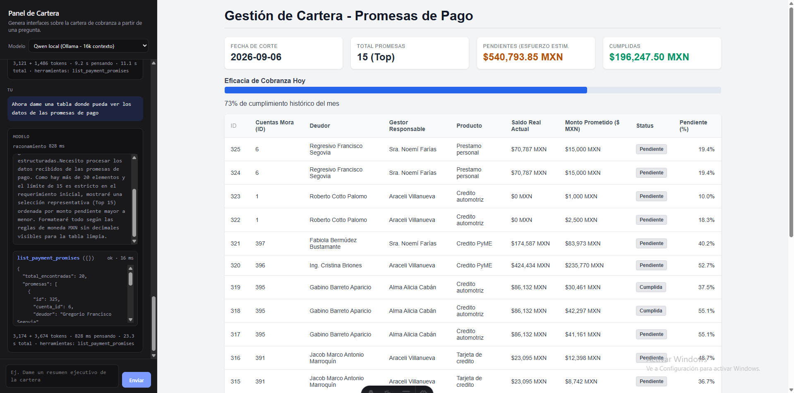

# MCP Cobranza: Panel Generativo de Cartera

Sistema de análisis y gestión de cartera de cobranza potenciado por **Model Context Protocol (MCP)**, **FastAPI**, **Astro** y **Modelos de Lenguaje Locales** (Ollama con GPU) o APIs en la nube (Claude).

<p align="center">
  
</p>

El sistema permite consultar métricas financieras, analizar morosidad, gestionar promesas de pago y generar interfaces interactivas en tiempo real bajo demanda a partir de preguntas en lenguaje natural.

```text
┌────────────────────────────────────────┐       ┌──────────────────────────────────────┐
│        Frontend Web (Astro)            │       │        Backend API (FastAPI)         │
│          http://localhost:4321         │──────▶│         http://localhost:8787        │
│    Chat en vivo + Sandbox <iframe>     │  SSE  │  Streaming de eventos y orquestación │
└────────────────────────────────────────┘       └──────────────────┬───────────────────┘
                                                                    │
                                         ┌──────────────────────────┴──────────────────────────┐
                                         ▼                                                     ▼
                         ┌───────────────────────────────┐                     ┌───────────────────────────────┐
                         │      Inferencia de Modelo     │                     │     Servidor MCP (9 tools)    │
                         │  - Qwen local (Ollama / GPU)  │                     │      src/backend/server.py    │
                         │  - Claude (Anthropic API)     │                     └───────────────┬───────────────┘
                         └───────────────────────────────┘                                     │
                                                                                               ▼
                                                                               ┌───────────────────────────────┐
                                                                               │      SQLite (cobranza.db)     │
                                                                               │       Cartera sintética       │
                                                                               └───────────────────────────────┘
```

---

## Características Principales

* **9 Herramientas MCP tipadas:** Consultas de alto nivel (KPIs globales, aging por cubetas, detalle de deudores, flujo de caja, ranking de gestores) y herramientas de escritura y lectura de promesas de pago.
* **Inferencia Local en GPU (Ollama):** Optimizado para `qwen3.5:16k` con 16,384 tokens de contexto, evitando costos de APIs externas y manteniendo la privacidad de los datos.
* **Soporte Híbrido:** Opción de alternar en caliente entre modelos locales y Claude 3.5 Sonnet (con *extended thinking* vía Anthropic API).
* **Streaming en Vivo (SSE):** Visualización en tiempo real del razonamiento del modelo (`thinking`), llamadas a herramientas con tiempos de respuesta en milisegundos y tokens consumidos.
* **Seguridad y Aislamiento:** El HTML/CSS generado se renderiza dentro de un `<iframe>` aislado para evitar inyección o colisión de estilos.
* **Docker Ready:** Listo para levantar con `docker compose up` con persistencia de base de datos y conexión a GPU host.
* **CI Automatizado:** Pipeline en GitHub Actions que valida pruebas unitarias, smoke test MCP y compilación de Astro en cada push.

---

## Herramientas MCP Disponibles

El servidor expone **9 herramientas** especializadas bajo el estándar MCP:

| Herramienta | Tipo | Parámetros | Descripción |
| :--- | :---: | :--- | :--- |
| `portfolio_summary` | Lectura | Ninguno | Resumen general: saldo vivo, saldo vencido, % cartera vencida, mora ponderada, monto recuperado en 30 días y tasa de promesas cumplidas. |
| `aging` | Lectura | Ninguno | Distribución de la cartera en cubetas de morosidad (`al_corriente`, `1-30`, `31-60`, `61-90`, `90+`). |
| `list_accounts` | Lectura | `bucket`, `gestor_id`, `estatus`, `orden`, `limite` | Consulta de cuentas con datos del deudor y gestor, con filtros y ordenamiento. |
| `get_account` | Lectura | `cuenta_id` | Detalle 360° de una cuenta: crédito, deudor, score buró e historial de pagos y promesas. |
| `get_debtor` | Lectura | `deudor_id` | Perfil consolidado del deudor con todas sus cuentas y saldo total vs en mora. |
| `cashflow` | Lectura | `desde`, `hasta`, `granularidad` | Flujo de cobranza agrupado por día, semana o mes en un rango de fechas. |
| `collector_stats` | Lectura | `desde`, `hasta` | Desempeño por gestor: saldo gestionado, monto recuperado y % de promesas cumplidas. |
| `register_payment_promise` | Escritura | `cuenta_id`, `monto_prometido`, `fecha_promesa`, `dias_plazo` | Registra una nueva promesa de pago en la base de datos con fecha calculada. |
| `list_payment_promises` | Lectura | `cuenta_id`, `cumplida`, `limite` | Consulta las promesas de pago registradas, con nombre del deudor, gestor y estatus. |

---

## Métricas y Fórmulas del Dominio

* **% Cartera Vencida:**
  $$\text{Pct Vencida} = \frac{\text{Saldo en mora}}{\text{Saldo vivo total}} \times 100$$
* **Días de Mora Promedio Ponderados por Saldo:**
  $$\text{Mora Ponderada} = \frac{\sum (\text{Saldo}_i \times \text{Días Mora}_i)}{\sum \text{Saldo}_i}$$
* **Recovery Rate (30 días):**
  $$\text{Recovery Rate} = \frac{\text{Recuperado (últimos 30d)}}{\text{Saldo Vencido} + \text{Recuperado (últimos 30d)}} \times 100$$
* **Efectividad de Promesas:**
  $$\text{Cumplimiento} = \frac{\text{Promesas Cumplidas}}{\text{Promesas Totales}} \times 100$$

> **Fecha de corte:** Fijada en `2026-09-01` en `seed.py` para garantizar reproducibilidad exacta en consultas y pruebas.

---

## Instalación y Puesta en Marcha

### 1. Requisitos Previos
* Python 3.10 o superior.
* Node.js 18 o superior.
* (Opcional) Ollama para inferencia local con GPU.

### 2. Configuración del Entorno y Base de Datos
```bash
# Crear y activar entorno virtual
python -m venv venv
venv\Scripts\activate       # En Windows
# source venv/bin/activate  # En Linux/macOS

# Instalar dependencias del backend en modo editable
pip install -e ".[dev]"

# Generar la base de datos sintética SQLite
python src/backend/seed.py
```

### 3. Modelo Local con 16k de Contexto (Ollama)
Para usar Qwen local sin que se corte el HTML por falta de contexto:
```bash
# Crear modelo con 16k de contexto usando el Modelfile del repositorio
ollama create qwen3.5:16k -f Modelfile
```

### 4. Levantar la Aplicación Web

**Terminal 1 — Backend (FastAPI en puerto 8787):**
```bash
uvicorn src.backend.web:app --host 127.0.0.1 --port 8787 --reload
```

**Terminal 2 — Frontend (Astro en puerto 4321):**
```bash
cd src/frontend
npm install
npm run dev
```

Abre **`http://localhost:4321`** en tu navegador para interactuar con el panel.

---

## Despliegue con Docker

Si prefieres levantar el stack completo sin configurar entornos locales:

```bash
# Levantar Backend + Frontend Nginx
docker compose up --build

# Para detener los servicios
docker compose down
```

---

## Modos de Ejecución Alternativos

### A. Probar el Servidor MCP Directamente
```bash
# Smoke test automático de las 9 herramientas vía stdio
python scripts/probe_mcp.py

# Inspeccionar interactivamente con MCP Inspector
npx @modelcontextprotocol/inspector python src/backend/server.py
```

### B. Generación por CLI (host.py)
```bash
# Generar interfaz directa desde terminal
python src/backend/host.py "Dame un resumen ejecutivo de la cartera"

# Generar lote de demostración en out/
python src/backend/host.py --demo
```

### C. Ejecución de Pruebas Unitarias
```bash
pytest -v
```

---

## Estructura del Repositorio

```text
MCP_Cobranza/
├── .github/workflows/
│   └── ci.yml               # Pipeline de CI (Backend + Astro build)
├── docs/
│   ├── CAPTURAS.md          # Guía de capturas de pantalla
│   ├── ejemplos/            # Dashboards HTML de demostración
│   └── img/                 # Assets y capturas (panel-chat.png)
├── scripts/
│   └── probe_mcp.py         # Cliente de prueba MCP vía stdio (9 tools)
├── src/
│   ├── backend/
│   │   ├── providers/       # Proveedores de IA (LlamaCpp / Anthropic)
│   │   ├── tools/           # Módulos de datos (portfolio, accounts, analytics, promesas)
│   │   ├── host.py          # Orquestador CLI de generación de HTML
│   │   ├── seed.py          # Generador de datos sintéticos (Faker)
│   │   ├── server.py        # Servidor MCP stdio con 9 herramientas
│   │   ├── tools_core.py    # Fachada de compatibilidad y registro TOOLS
│   │   └── web.py           # API FastAPI con streaming SSE
│   └── frontend/            # Aplicación web Astro (chat + preview iframe)
├── tests/
│   └── test_tools.py        # Suite de pruebas unitarias (12 tests)
├── docker-compose.yml       # Orquestación de contenedores
├── Dockerfile.backend       # Dockerfile para FastAPI
├── Modelfile                # Definición de modelo Ollama con 16k contexto
├── pyproject.toml           # Configuración del paquete y dependencias
└── walkthrough.md           # Bitácora técnica de arquitectura y diseño
```
